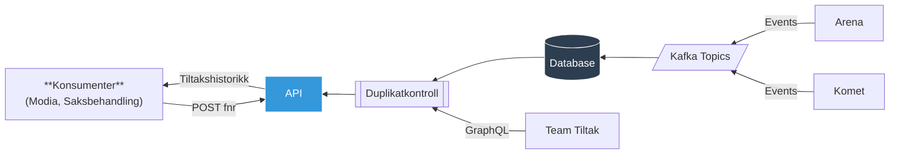

# mulighetsrommet-tiltakshistorikk

Tiltakshistorikk for brukere som deltar eller har deltatt på arbeidsmarkedstiltak hos Nav.

## For konsumenter

### Datamodell

Datamodellen er definert i [
`TiltakshistorikkV1Dto.kt`](../common/tiltakshistorikk-client/src/main/kotlin/no/nav/tiltak/historikk/TiltakshistorikkV1Dto.kt)
og inneholder tre typer deltakelser:

- Deltakelser fra Arena (opphav: `ARENA`)
- Tiltak hos arrangør fra Tiltaksadministrasjon/Modia (opphav: `TEAM_KOMET`)
- Tiltak hos arbeidsgiver fra Avtale-løsningen til Team Tiltak (opphav: `TEAM_TILTAK`)

### Historiske identer

Tiltakshistorikken er lagret per fødselsnummer, og historikk kan hentes for ett eller flere fødselsnummer i samme
forespørsel.

**Viktig:** For å garantere komplett tiltakshistorikk for én person må du:

1. Gjøre oppslag mot PDL for å hente alle historiske identer til personen
2. Hente tiltakshistorikk for hvert fødselsnummer
3. Slå sammen resultatet selv

### Personvern og auditlogging

Tiltakshistorikken inneholder persondata (blant annet kan brukerens lokasjon utledes fra tiltaket). Vurder derfor om
oppslag mot tiltakshistorikken skal auditlogges på vegne av Nav-ansatt.

## Hva

Tiltakshistorikken samler tiltaksdeltakelser fra ulike kildesystemer og tilgjengeliggjør data bak ett felles
grensesnitt.

Applikasjonen håndterer duplikatkontroll ved å returnere deltakelser basert på når tiltakstypen ble migrert fra Arena
til nytt system. Målet er at tiltakshistorikken til enhver tid skal presentere alle tiltaksdeltakelser hos Nav.

### Dekningsgrad

Tiltakshistorikken inkluderer:

- **Arrangør-tiltak** som har blitt migrert fra Arena til nye systemer (Tiltaksadministrasjon/Modia)
- **Arbeidsgiver-tiltak** som har blitt migrert fra Arena til nye systemer (Avtale-løsningen til Team Tiltak)
- **Historiske deltakelser fra Arena**
    - Inkludert aktive tiltak som enda ikke har blitt migrert fra Arena
    - Unntak: Enkelte deltakelser i planlagt tilstand som aldri startet er ikke inkludert

## Hvorfor

Flere parter i Nav har behov for å se samlet tiltakshistorikk for en gitt bruker, blant annet:

- Veiledere i Modia
- Ulike saksbehandlingsløsninger

## Hvordan

Tiltakshistorikken holdes oppdatert ved å lytte på Kafka-events fra Arena og Komet. Tiltak fra Team Tiltak hentes
on-demand via GraphQL når konsumenter spør etter historikk.

### Duplikatkontroll

For å unngå duplikater mellom Arena og nye systemer brukes to ulike strategier:

- **Tiltak hos arrangør:** Alle deltakelser per tiltakstype har blitt migrert. Arena-deltakelser for disse tiltakstypene
  filtreres derfor helt bort.
- **Tiltak hos arbeidsgiver:** Disse har over tid vært dobbeltregistrert i både Arena og Avtale-løsningen til
  Team Tiltak. Vi bruker derfor cut-off datoer per tiltakstype som angir når migreringen skjedde.
  Deltakelser som strekker seg forbi cut-off dato hentes fra Team Tiltak, mens de som ble avsluttet før cut-off dato
  hentes fra Arena.
