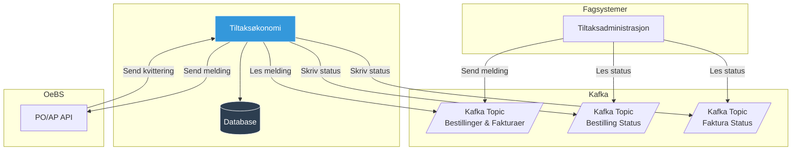

# Tiltaksøkonomi

Tiltaksøkonomi er en integrasjonstjenste og Anti-Corruption Layer (ACL) mot OeBS PO/AP (Oracle E-Business Suite,
Purchase Order/Account Payables) for å håndtere utbetalinger til bedrifter for gjennomføring av arbeidsmarkedstiltak.

Tjenesten håndterer:

- **Bestillinger (tilsagn):** Holder av penger til en tiltaksarrangør
- **Fakturaer (utbetalinger):** Utbetaler penger til tiltaksarrangøren, basert på tidligere bestillinger
- **Annulleringer:** Kansellerer bestillinger som ikke skal utbetales
- **Kvitteringer:** Mottar og videresender bekreftelser på bestillinger og fakturaer fra OeBS tilbake til fagsystemene

## API

Kommunikasjon med tjenesten foregår via Kafka.

### Meldingstyper

Følgende meldingstyper er
støttet ([definert i kode her](./common/tiltaksokonomi-client/src/main/kotlin/no/nav/tiltak/okonomi/OkonomiBestillingMelding.kt)):

| Type                | Beskrivelse                                                 |
|---------------------|-------------------------------------------------------------|
| `Bestilling`        | Oppretter en ny bestilling (tilsagn) i OeBS                 |
| `Annullering`       | Annullerer en eksisterende bestilling                       |
| `Faktura`           | Oppretter en faktura for utbetaling basert på en bestilling |
| `GjorOppBestilling` | Gjør opp en bestilling uten å betale ut resterende midler   |

### Kvitteringer fra OeBS

OeBS sender kvitteringer tilbake til Tiltaksøkonomi via egne HTTP-endepunkter. Disse kvitteringene inneholder status for
bestillinger og fakturaer, som deretter publiseres til dedikerte Kafka-topics slik at fagsystemene kan oppdatere sin
tilstand i henhold til dette.

## Arkitektur

Fagsystemer produserer Kafka-meldinger for bestillinger og fakturaer på en felles topic. Tiltaksøkonomi konsumerer disse
meldingene, sender dem videre til OeBS via HTTP/JSON, og publiserer status tilbake på egne topics som fagsystemene
kan lytte til.

Kommunikasjonen med OeBS foregår via HTTP API som kjører på Nais (OeBS PO/AP API). Denne modulen skriver
meldingene til et eget grensesnitt (filområde) hos OeBS, som deretter blir de plukket opp og prosessert av enten PO-
eller AP-modulen i OeBS avhengig av hvilken meldingstype det er (PO=bestilling og AP=faktura) basert på et konfigurert
CRON-schedule. Tilsvarende gjelder også for kvitteringer fra OeBS tilbake Tiltaksøkonomi.

Tjenesten sørger for at:

- Meldinger til OeBS blir levert i samme rekkefølge som de blir produsert, samt at meldinger ikke blir sendt til OeBS
  før evt. avhengigheter først er mottatt og kvittert ut (f.eks. så kan ikke OeBS prosessere en faktura-melding før
  bestillingen har blitt opprettet OK)
- Feilede meldinger blir håndtert og kan prøves på nytt
- Fagsystemer får tilbakemelding om status via dedikerte Kafka-topics

## Feilsøking

Kvitteringene fra OeBS inneholder noe informasjon om hva som har gått galt. Det er ikke alltid lett å vite hva som har
skjedd i praksi, men noen av feilsituasjonene som har oppstått blir dokumentert under.

## Feilkoder fra OeBS og indikasjoner på hva det kan bety

- **PO_PDOI_INVALID_PROJ_INFO:** Det er noe feilkonfigurasjon hos OeBS
    - Mulig årsak kan være ugyldig tilsagnsår, altså at tilsagn blir forsøkt opprettet for langt frem i tid.
    - Krever endringer hos OeBS før feil evt. kan løses.
- **DUPLICATE INVOICE NUMBER (INVOICE):** Returneres når duplikat har blitt sendt/mottatt hos OeBS
    - Kan oppstå ved f.eks. nettverksproblemer og at http-requesten timer ut etter at faktura-melding har blitt
      skrevet/levert til grensesnittet. Siden tjenesten ikke med sikkerhet kan vite om en melding blir levert ved slike
      http-feil vil den forsøke på nytt, noe som kan resultere i duplikater.
    - Denne type feil burde løse seg selv etter at OeBS har håndtert/utbetalt den første av duplikatene.
